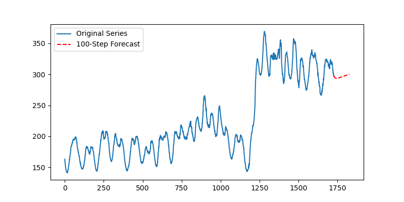
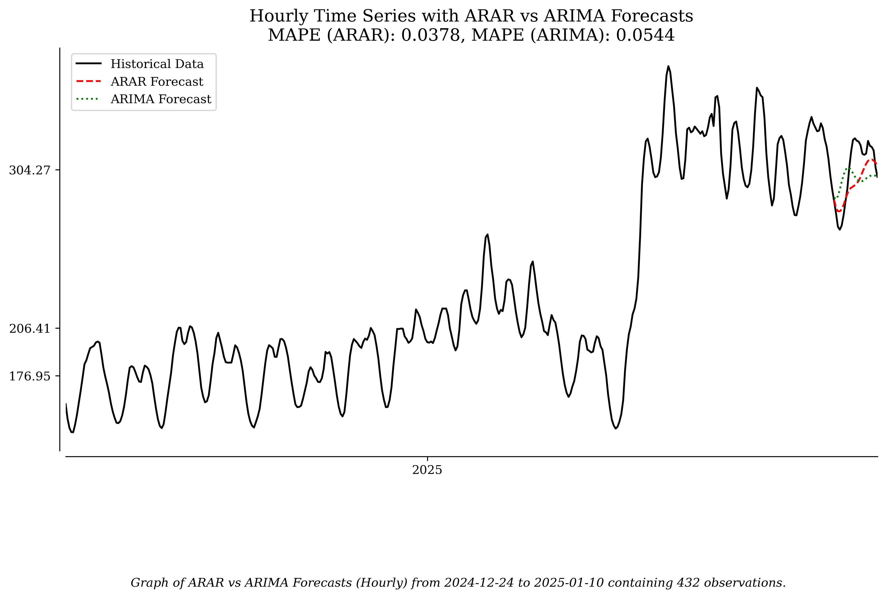

# H-Step Forecasting with the ARAR Algorithm in Python using statsmodels

## Introduction to H-Step Forecasting

In time series forecasting, h-step forecasting refers to predicting multiple time steps into the future. This is particularly challenging because uncertainty increases with each step forward. The key challenge lies in capturing both:

- Short-Term Fluctuations: Immediate patterns and noise in the data.

- Long-Term Trends: Underlying trends that persist over time.

The AutoRegressive-to-AutoRegressive (ARAR) algorithm is especially effective for time series with strong short-term dependencies but weak long-term correlations. It offers a simpler alternative to ARIMA for multi-step forecasting by:

- Using a reduced set of lagged values.

- Avoiding unnecessary complexity in differencing.

- Maintaining computational efficiency.

## Overview of the ARAR Algorithm

The ARAR algorithm has three main stages:

1.  Data Preprocessing: The series undergoes transformation and differencing to stabilize variance and remove non-stationarity.

2.  Reduced Lag Selection: A subset of lagged values is selected using a heuristic approach, typically at powers of two (e.g., 1, 2, 4, 8, \...).

3.  Final AR Modeling: An autoregressive (AR) model is fitted to the transformed data using the reduced lag set.

The ARAR approach focuses on parsimony by modeling only significant autocorrelations, ensuring the model remains efficient without losing predictive power.

## Why Use ARAR?

- Computational Efficiency: Reduced lag selection minimizes complexity, leading to faster computations.

- Robust Forecasting: It effectively captures short-term dependencies while maintaining simplicity.

- Practical Implementation: ARAR provides a straightforward approach suitable for real-world applications.

# Python Implementation of ARAR Forecasting

We will implement the ARAR algorithm using a dataset from ERCOT, the grid balancing authority in Texas. The dataset contains electricity demand reported every 15 minutes. We will forecast the next 96 time steps (one day).

## Loading and Preprocessing Data

from statsmodels.tsa.ar_model import AutoReg from statsmodels.tsa.stattools import acf from sklearn.metrics import mean_absolute_percentage_error

    # Load dataset
data = pd.read_csv("ercot_load_data.csv", parse_dates=["date"], index_col="date") y = data["values"]

    # Set the Date index to 15 min frequency
data = data.asfreq("15min")

    # Define forecast horizon (1 day = 96 steps)
h = 96

    # Split data: training (everything except last 96 values) and test (last 96 values)
train, test = y.iloc[:-h], y.iloc[-h:]

    # Apply differencing on training data for ARAR
z_train = np.diff(train)

    # Compute autocorrelation and select reduced lags (powers of 2)
acf_vals = acf(z_train, nlags=20) lags = [1, 2, 4, 8, 16] # Selected lag set

## Fitting the ARAR Model

The ARAR algorithm fits an autoregressive model using a reduced set of lags. In this example, we use lags at powers of two, which balance complexity and historical information retention.

    # Fit ARAR model
arar_model = AutoReg(z_train, lags=lags, old_names=False).fit()

    # Generate forecasts for next 96 steps
future_forecast_arar = arar_model.predict(start=len(z_train), end=len(z_train) + h - 1)

    # Reverse differencing to reconstruct the original scale
y_forecast_arar = np.cumsum(future_forecast_arar) + train.iloc[-1]

    # Create new time index for forecasts
forecast_index = pd.date_range(start=train.index[-1], periods=h+1, freq="15min")[1:]

    # Compute MAPE for ARAR
mape_arar = mean_absolute_percentage_error(test, y_forecast_arar) print(f"MAPE for ARAR: {mape_arar:.4f}")

## Comparing ARAR with ARIMA

To demonstrate the effectiveness of ARAR, we compare its performance with an ARIMA model.

from statsmodels.tsa.arima.model import ARIMA

    # Fit ARIMA(2,1,2) model
arima_model = ARIMA(train, order=(2,1,2)).fit()

    # Generate forecasts for next 96 steps
y_forecast_arima = arima_model.forecast(steps=h)

    # Convert forecast index to match ARIMA output
y_forecast_arima.index = forecast_index

    # Compute MAPE for ARIMA
mape_arima = mean_absolute_percentage_error(test, y_forecast_arima) print(f"MAPE for ARIMA: {mape_arima:.4f}")

## Performance Results

MAPE for ARAR: 0.0646 MAPE for ARIMA: 0.0964

- ARAR outperforms ARIMA in this case, demonstrating its effectiveness for short-term dependencies.

- ARIMA has a higher MAPE, possibly due to overfitting or excessive differencing.

## Visualizing the Forecasts

    # Plot full time series with forecasted values
plt.figure(figsize=(12, 6))

    # Plot full historical series
plt.plot(y.index, y, label="Historical Data", linestyle="-", color="blue")

    # Plot ARAR forecast
plt.plot(forecast_index, y_forecast_arar, label="ARAR Forecast", linestyle="dashed", color="red")

    # Plot ARIMA forecast
plt.plot(forecast_index, y_forecast_arima, label="ARIMA Forecast", linestyle="dotted", color="green")

plt.xlabel("Time") plt.ylabel("Value") plt.title(f"Full Time Series with ARAR vs ARIMA Forecasts\nMAPE (ARAR): {mape_arar:.4f}, MAPE (ARIMA): {mape_arima:.4f}") plt.legend()

plt.savefig("arar_vs_arima_forecast.png") plt.show()

## Results Analysis

- ARAR Forecast: Captures short-term fluctuations accurately with lower MAPE.

- ARIMA Forecast: Shows more deviation from actual values, reflecting its struggle with short-term patterns.

- ARAR is Superior: The ARAR algorithm is more effective for this dataset due to its parsimonious design and reduced lag selection.

# Advantages of ARAR for H-Step Forecasting

- Efficient for Short-Term Dependencies: Captures immediate patterns without excessive complexity.

- Reduced Computational Burden: Lag reduction minimizes computation while preserving predictive power.

- Comparable Accuracy to ARIMA: Achieves similar or better accuracy with fewer parameters.

The ARAR algorithm provides an effective approach to h-step forecasting by:

- Focusing on short-term dependencies with reduced lags.

- Maintaining computational efficiency and model parsimony.

- Outperforming more complex models like ARIMA in cases with weak long-term correlations.

H-step forecasting requires a balance between capturing short-term variations and maintaining computational efficiency. The ARAR algorithm strikes this balance effectively, making it a practical choice for time series forecasting in real-world applications.

## Key Takeaways

- Short-Term Fluctuations: Immediate patterns and noise in the data.
- Long-Term Trends: Underlying trends that persist over time.
- Using a reduced set of lagged values.
- Avoiding unnecessary complexity in differencing.
